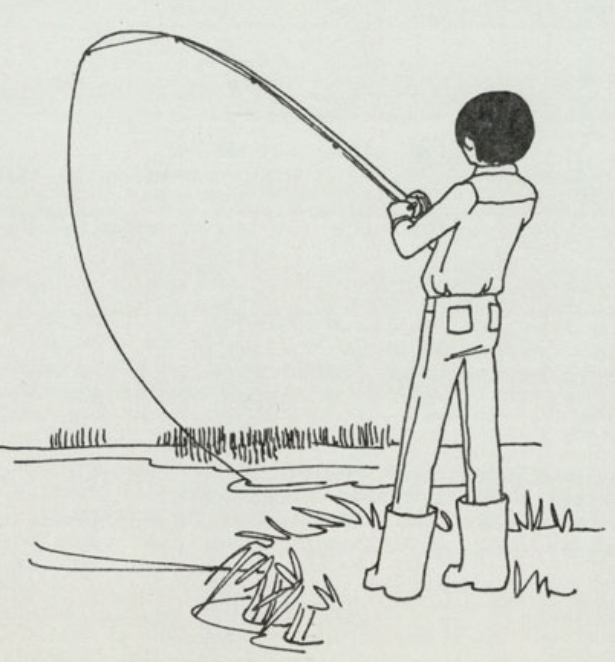
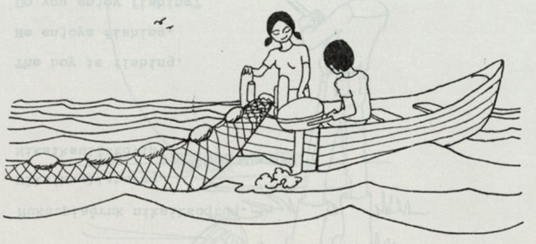

<!-- Reminders: if something isn't loading great, you can use two commands in this order. system("quarto render") and then system("quarto preview") -->

::::: {#two-panel .two-panel}
::: main-panel
<h2>Inupiaq</h2>

```{=html}
<div class="main-content">

<!-- PARAGRAPH 1 -->
<div class="text-image-row">
  
  <div class="text-lines">
    
    <div class="my-hover">
      Nukatpiaġruk niksiksuqtuq.

      <div class="my-hover-text">
        <p><strong>Nukatpiaġruk niksik-suq-tuq</strong></p>
      </div>
    </div>

    <div class="my-hover">
      Niksiksullaturuq.

      <div class="my-hover-text">
        <p><strong>Niksik-su-llatu-ruq</strong></p>

        <p>Postbase "su" means "regularly".</p>

        <p>Postbase "llatu" means "to enjoy Xing".</p>

        <p>Ending "ruq" is for intransitive, indicative, third-person singular. While third-person "tuq" is used when following a consonant, "ruq" is used when following a vowel.</p>
      </div>
    </div>

    <div class="my-hover">
      Niksiksullatuviñ?

      <div class="my-hover-text">
        <p><strong>Niksik-su-llatu-viñ</strong></p>

        <p>Ending "viñ" is for intransitive, interrogative, second-person singular.</p>
      </div>
    </div>
  </div>
  
</div>

<br><br>
<br><br>

<!--- PARAGRAPH 2 --->
<div class="text-image-row">

  <div class="text-lines">
  
    <div class="my-hover">
      Aġnaġlu nukatpiaġlu kuvriqsuk.

      <div class="my-hover-text">
        <p><strong>Agnaq-lu nukatpiaq-lu kuvrIq-tuk</strong></p>

        <p>Postbase "lu" means "and". Notice it is marked on both subjects in the sentence.</p>

        <p>Ending "tuk" is for intransitive, indicative, third-person dual marking.</p>

        <p>Notice the strong i in "kuvrIq"? Near the end of the word, it palatalizes the "t" in "tuk" to "s".</p>
      </div>
    </div>
    
    <div class="my-hover">
      Nukatpiaq aquttuq.

      <div class="my-hover-text">
        <p><strong>Nukatpiaq aqut-tuq</strong></p>

        <p>Ending "tuq" is for intransitive, indicative, third-person singular. Note how it is different from "tuk" in the previous story line.</p>
      </div>
    </div>
    
    <div class="my-hover">
      Kuvriqsiḷḷaviñ?

      <div class="my-hover-text">
        <p><strong>Kuvriq-si-ḷḷa-viñ</strong></p>

        <p>Postbase "ḷḷa" means "to be able to".</p>

        <p>Ending "viñ" is for intransitive, interrogative, second-person, singular.</p>
      </div>
    </div>
  </div>
  
</div>


</div>
```
:::


::: {#side-panel .side-panel}
<h2>English</h2>

<p> Let's Read! by Edna Agheak MacLean </p>

  <p> The boy is fishing. </p>

  <p> He enjoys fishing. </p>

  <p> Do you like fishing? </p>

<br><br>

  <p> The woman and the young man are setting a net. </p>

  <p> The young man is steering the boat. </p>

  <p> Can you set a net? </p>

:::

```{=html}
<button class="toggle-button" id="toggle-button" onclick="togglePanel()">

›

</button>
```

:::::

```{=html}
<!-- This is javascript -->
<script>

function togglePanel() {

<!-- find the two panel container and... -->
const container = document.getElementById("two-panel");

<!-- allow for the container to be open or collapsed --> 
container.classList.toggle("collapsed");

<!-- find the button and... -->
const button = document.getElementById("toggle-button");

<!-- change the direction of the arrow if open or collapsed -->
if (container.classList.contains("collapsed")) {
button.textContent = "‹";
} else {
button.textContent = "›";
}
}

</script>
```

